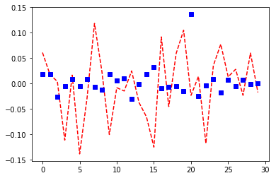

# Algorithmic Approaches to Blockchain Markets
##### Scott Sussex, Humza Tahir, Junaid Zubair, Ibrahim Syed, Arkam Javed

## Table of Contents

1. **Prototype 1: Sentiment Analysis Algorithm** (Discontinued)
    - Correlation model (shows correlation between Reddit data and price tomorrow)
    - Price prediction model (uses multinomial linear regression to predict future expected price, to inform trade decisions)
    
     
    
    - Model discontinued, because our algorithms struggled to differentiate between good and bad sentiment, and the technology needed to do this is not mature enough yet (or would require a very high level of technical investment, with uncertain result). However, we did see that price and volume were excellent predictors, even without the consideration of sentiment, so we shifted our project towards making the most of these inputs through advanced machine learning... (Prototype 2)
  
  
  
2. **Prototype 2: Deep Q Networks (DQN) Algo-trader** (Current Model)
    - The DQN Classifier (predicts whether it is advantageous to hold Bitcoin versus cash at any given moment)
      - Scott implemented a virtual currency exchange that simulates how much a person would benefit from a trade, given transaction costs and market shifts
      - The classifier uses an innovative machine learning to learn patterns from price fluctuations in order to develop a coherent and constantly updating trading strategy
      - Result: the trading strategy is reasonable (performs well in low growth scenarios, but high growth scenarios, it just tells us to hold Bitcoin). While we were hoping for a more nuanced strategy in high market growth scenarios, holding bitcoin is not a bad outcome in such scenario. As the market matures and growth slows down (and more data is put into the DQN algorithm) we expect the trader to stabilize and make more nuanced trade decisions.
      

## Next Steps

To ensure the DQN algo-trader is meaningful and not over-fitting on Bitcoin and Ethereum, we will need to

1. Scrape data from other coins/tokens
2. Test the DQN algo-trader on these new datasets
3. Revise the algorithm to make it more versatile in a variety of market conditions
4. Upon completetion, test drive the algorithm on 3 months of fresh data as it comes in from exchanges (standard practice for testing trading algorithms at some quant hedge funds). Compare results to conventional trading strategies
5. Deploy algorithm on real-world portfolio
